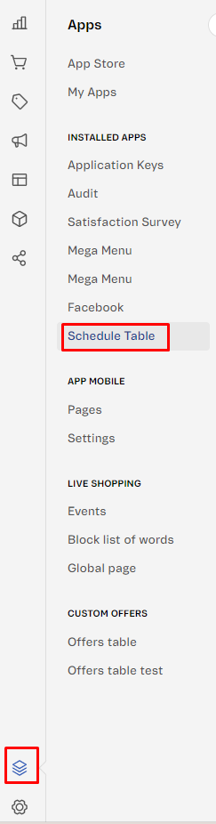
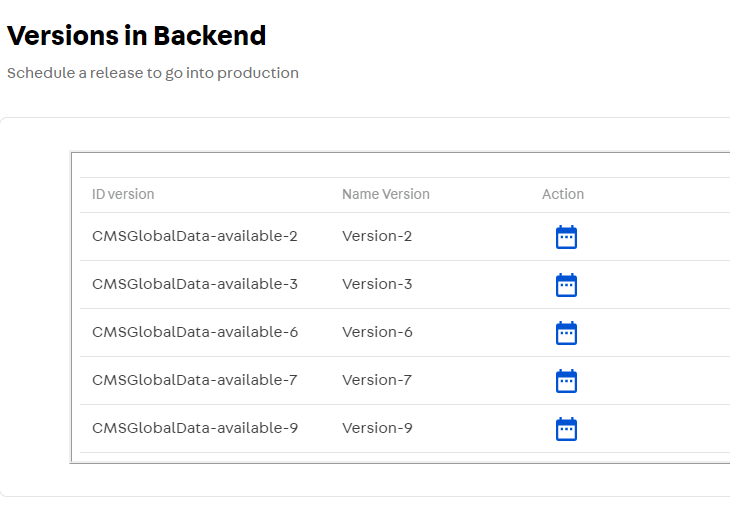
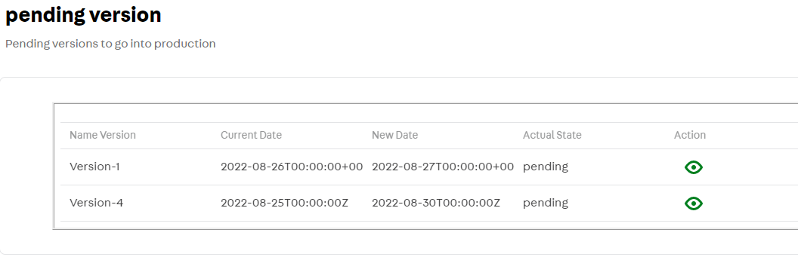
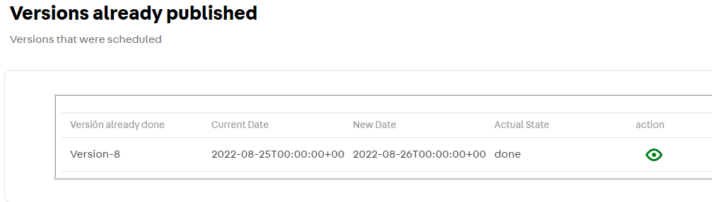
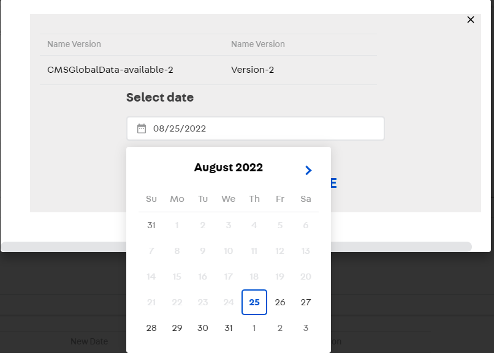
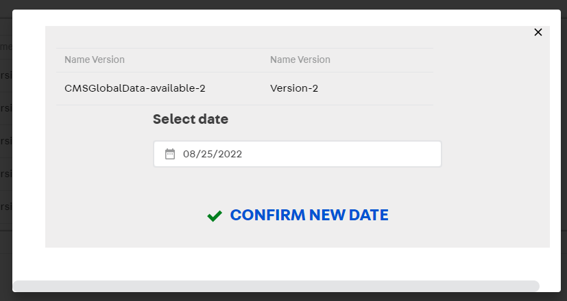
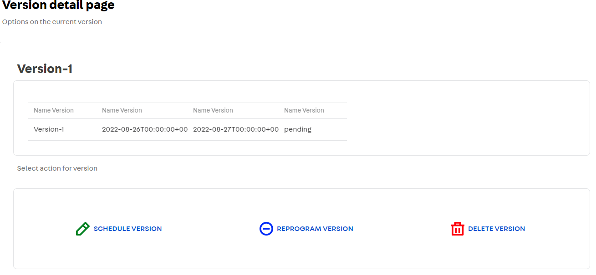
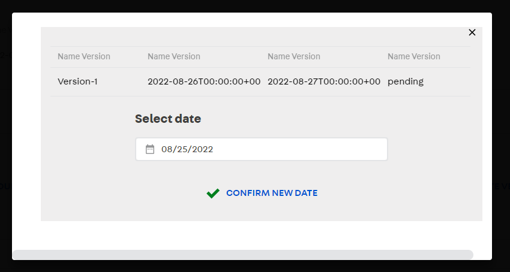
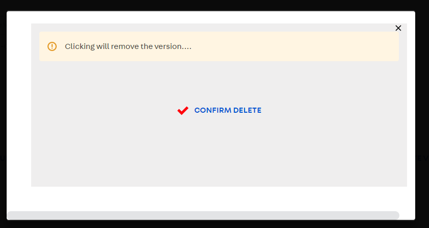

# Manejo del componente ProgramVersion

El componente se ha creado con el fin de dar un manejo a la versiones creadas por el backend, pudiendo ser usadas y administradas por el backoffice desde el CMS proporcionado por Vtex.

## Aspectos básicos del componente

1. **Localización el en CMS:** El componente se localiza como un submenú en el apartado **STORE SETUP** , en al ruta `Schedule Version/Schedule Table`.

2. **Versiones en Backend:** Es la primera vista al componente, donde se encontrarán todas las versiones disponibles para poder ser agendadas desde el backend y con las cuales se podrán trabajar.

3. **Versiones Pendientes:** Son las versiones que ya han sido programadas en el CMS y están en lista de espera para pasar al ambiente productivo.

4. **Versiones ya publicadas:** Son las versiones que ya fueron programadas y ejecutadas, su vista en el ambiente productivo ya caducó, así que no aparecerán en el apartado de Backend ni en pendientes. Se maneja como un registro para evitar la repetición continua de versiones en el ambiente productivo.

## Programar una versión
En la tabla de **Versiones Backend**  encontraremos una tabla con diferentes columnas, para programar una versión basta con pulsar sobre el icono situado en la columna ***Acción*** de la versión que se quiera programar.

Se desplegará un modal en el cual tendremos la información de la versión que seleccionamos, además de un campo para escoger la fecha en la cual se va a programar dicha versión. Habiendo confirmado estos datos, para finalizar presionamos el botón ***Confirm New Date***.

***Nota:** Las versiones programadas no se pueden agendar para el día en curso, la versión pasará a estado **pending,** y se ejecutará en el ambiente productivo a las 0:00 horas del día siguiente.*

## Reprogramar una versión

Todas las versiones que se programen pasarán inmediatamente a la tabla de **Versiones Pendientes**, allí se podrá observar su estado actual además de su fecha de agendamiento.

Presionando el icono de la columna ***Acción*** podremos acceder a la información detallada de la versión, además de 3 botones de para la modificación de la versión:

1.  ***Programar Versión*** *(sólo activa en las versiones mostradas en la tabla de **Versiones ya publicadas**)*, la cuál servirá para programar una versión que ya ha sido publicada en el ambiente productivo.

2. ***Reprogramar Versión***, el cual desplegara el modal anteriormente visto donde se podrá hacer la respectiva modificación de su fecha de publicación.

3. ***Borrar versión***, el cual desplegará un modal para confirmación de la eliminación de la versión, dada la situación de que no se desee publicar.

